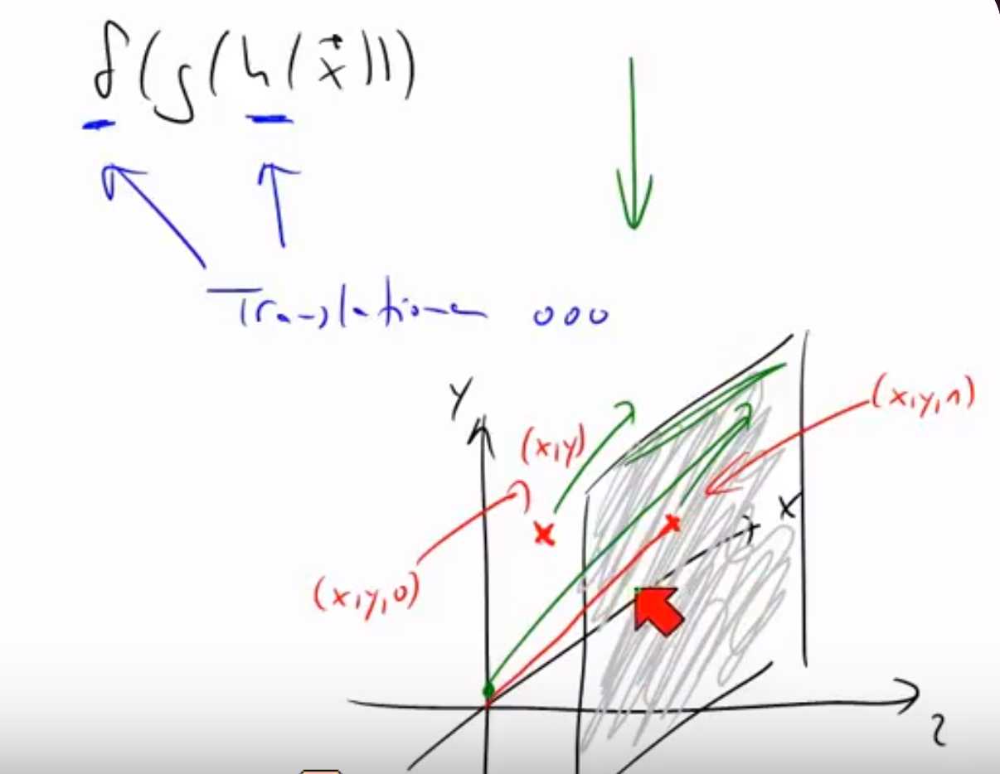
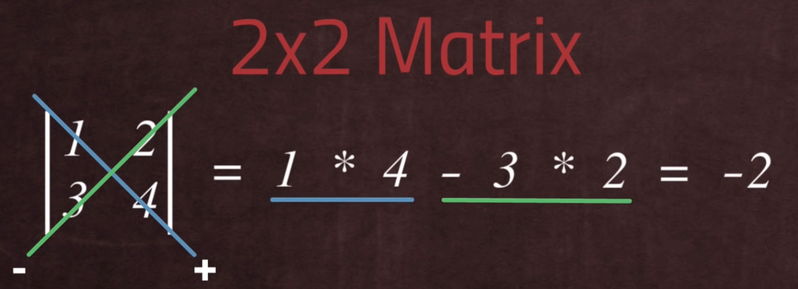
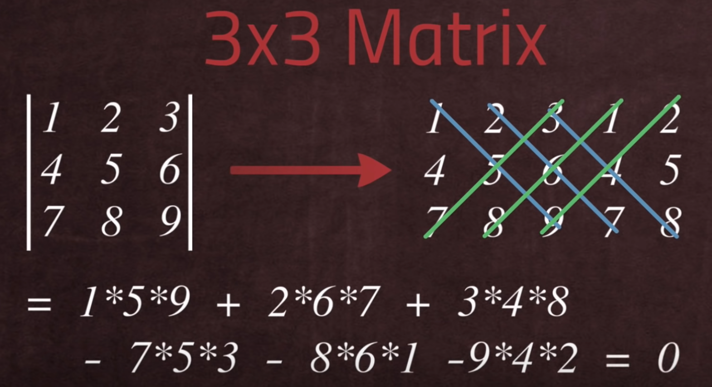

### 10.2 Homogeneous coordinates 

#### What?

"adding extra dimension is called hommogeneous coordinates" (quote lenas files)

#### Why?

By differentiating in local coordinates and world coordinates, a goal is to bring every local coordinate system with ONE transformation to worldcoordinates.

__In general: Combine a couple of transformations (rations, scalations, translations) to one matrix.__

#### How?

__In general: Add an extra dimension.__

- movement in one layer but from the view of the room (from 2D to 3D)
- display (x,y,0) on z-axis 1 would be (x,y,1) and from the origin to the new point it becomes a vector --> from 2D translation in 3d  it becomes a linaer map 

- because we are already working in computer graphics in 3D we go another step/level higher so from 3D to 4D to 

• vectors form: (x,y,z,0)
• points form: (x,y,z,1), or generalized (wx,wy,wz,w) 
• matrixs form:     ( a11, a12, a13, t1 
                      a21, a22, a23, t2
                      a31, a32, a33, t3 
                      0,   0,   0,   1)

#### Why in CG?

Calculation in 3D is too hard and too much, adding a dimension is easy, calculation back is easy too.

<!--- Note: (- linear maps can be multiplicated with each other and then just the produkt matrix M has to be used 
- some times are just translation matrixes are given, then its not possible
- when adding extra dimension it becomes possible
(maps can be displayed as matrixes))

(transformation matrix is linear map?)
(btw affinie trasformation is back to the origin )
"affine == linear transformtion + translation" - angela  -->

## Task 10.4 ##

Yes, it is a affine transformation, because it can be displayed in one transformation matrix.

There has been a transformation by 90°, a shearing by the factor 1, a scaling in the x-axis by the factor 1/2 and a translation by 1/2 on the x-axis.

 
 
Matrix for rotation

$$
\left(\begin{array}{cc} 
cos(90) & -sin(90)\\
sin(90) & cos(90)
\end{array}\right)
$$ 

 

Matrix for scaling and shearing
$$
\left(\begin{array}{cc} 
1 & -1\\
0 & 1/2
\end{array}\right)
$$ 

 

Translation vector
$$
\left(\begin{array}{cc} 
0\\
1/2
\end{array}\right)
$$ 

 

which then can be represented in the equation

$$
M =
\left(\begin{array}{cc} 
cos(90) & -sin(90) & 0\\
sin(90) & cos(90) & 0\\
0 & 0 & 1
\end{array}\right)
\left(\begin{array}{cc} 
1 & -1 & 0\\
0 & 1/2 & 1/2\\
0 & 0 & 1
\end{array}\right)
$$ 

 

which finally results through matrix multiplication into

$$
M =
\left(\begin{array}{cc} 
cos(90) & -cos(90)-sin(90)/2 & -25sin(a)\\
sin(90) & -sin(90)+cos(90)/2 & 25cos(a)\\
0 & 0 & 1
\end{array}\right)
$$

 

 

original  
transformed

 

## Task 10.5 ##

The transformation represented by the matrix results in a scaling on the y and the z axis by a facter of 2 and a translation by 1 in all 3 dimensions.  

the according visualisation would look like:

 

original cube  
transformed cube

### 10.6

#### What?
Getting a real number from a matrix.

#### Why?
The determinant of a linear transformation measures how much __areas (2D)/volumes (3D) change__ during the transformation.

#### How?

__Condition:__ Matrix has to have as much rows as columns. (square)

__Notation:__ Remove caps from the matrix and draw a line left and right.

__Calculation:__

2D matrixes 

3D matrixes 

Hints: 
- If the result is negative, the orientation of space is inverted. 
- If it's 0 the form is just a flat plane, line or point.
